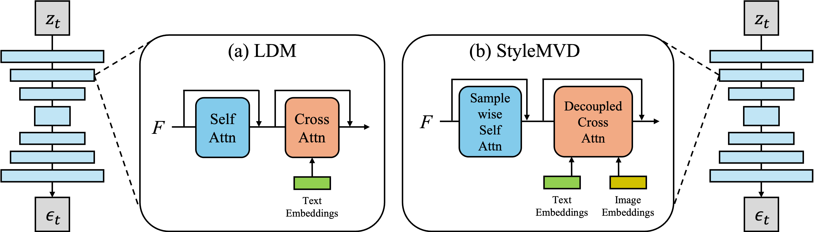

<div align="center">
<h1>StyleMVD: Tuning-Free Image-Guided Texture Stylization by Synchronized Multi-View Diffusion</h1>
</div>


We propose StyleMVD, a high quality texture generation framework guided by style image reference for textured 3D meshes. Style transfer in images has been extensively researched, but there has been relatively little exploration of style transfer in 3D meshes. Unlike in images, the key challenge in 3D lies in generating a consistent style across views. While existing methods generate mesh textures using pretrained text-to-image (T2I) diffusion models, accurately expressing the style of an image in text remains challenging. To overcome this, we propose StyleMVD module that enables to transfer the consistency style among the different views without additional fine-tuning from the reference style image. Specifically, StyleMVD converts existing self-attention into sample-wise self-attention to acheive global coherence, and decouples cross-attention in diffusion models to inject the style feature from the reference style image. Our experiments show that the proposed StyleMVD can achieve impressive results in both consistent image-to-texture style transfer and texture quality at high speed.


## Pipeline

<p align="center">
  
</p>
We first render the input textured mesh to generate condition images and view prompts based on the camera poses. Text embeddings are then extracted from the view prompts, while an image embedding is obtained from the input style image. Each view-dependent text embedding is concatenated with the image embedding and forwarded into the StyleMVD with condition images. After the view-dependent denoising process, the stylized images are unprojected onto the input mesh.

&nbsp; 

<p align="center">
  
</p>
Illustrations of the U-Net architectures in (a) Latent Diffusion Model (LDM) and (b) StyleMVD. The basic blocks of U-Net in LDM comprise a residual block, self-attention, and cross-attention, initially designed to accept only text embeddings. In our StyleMVD, we modify the self-attention to sample-wise self-attention and the cross-attention to decoupled cross-attention to facilitate 3D mesh texture stylization from the reference image. 


## Installation and download models
Follow [IP-Adapter](https://github.com/tencent-ailab/IP-Adapter?tab=readme-ov-file#download-models) to download pre-trained checkpoints from [here](https://huggingface.co/h94/IP-Adapter). We have tested on Python 3.10, CUDA 12.1, Pytorch 2.1.2, Pytorch3d 0.7.5, diffusers 0.27.2. Downloading IP-Adapter models can takes quite long time.

```
# create the environment
conda create -n stylemvd python=3.10
conda activate stlyemvd
pip install -r requirements.txt

# download the models
git lfs install
git clone https://huggingface.co/h94/IP-Adapter
mv IP-Adapter/models models
mv IP-Adapter/sdxl_models sdxl_models
```

Then install PyTorch3D through the following URL (change the respective Python, CUDA and PyTorch version in the link for the binary compatible with your setup), or install according to official installation guide
```
pip install https://dl.fbaipublicfiles.com/pytorch3d/packaging/wheels/py310_cu121_pyt212/download.html
```

## Inference
```
python run_stylemvd.py --config=data_mesh/face/config.yaml
python run_stylemvd.py --config=data_mesh/sneaker/config.yaml
```


## Start a local gradio demo <a href='https://github.com/gradio-app/gradio'></a>
```
python gradio_demo/app.py
```


## Acknowledgements
StyleMVD code is based on the official implementation of [InstantStyle](https://github.com/InstantStyle/InstantStyle), and [SyncMVD](https://github.com/LIU-Yuxin/SyncMVD/tree/main).

